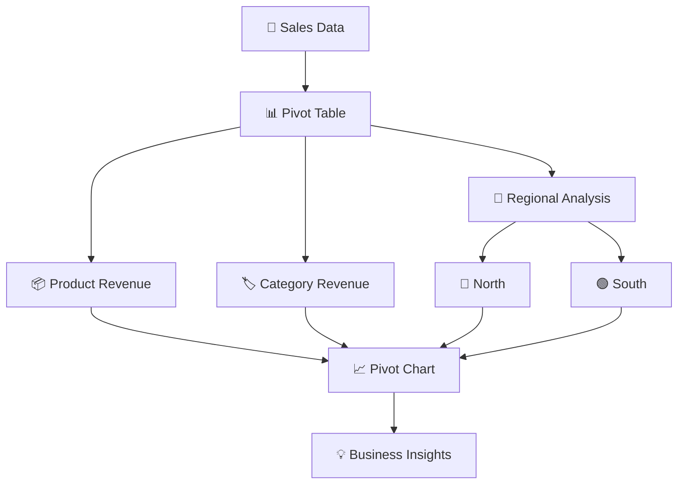
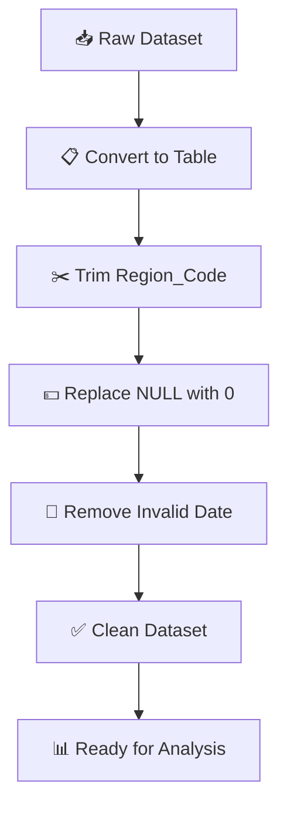
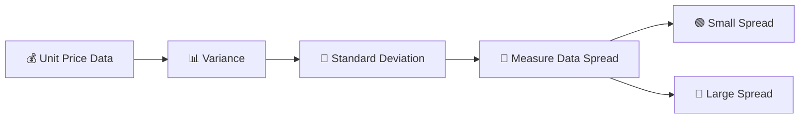
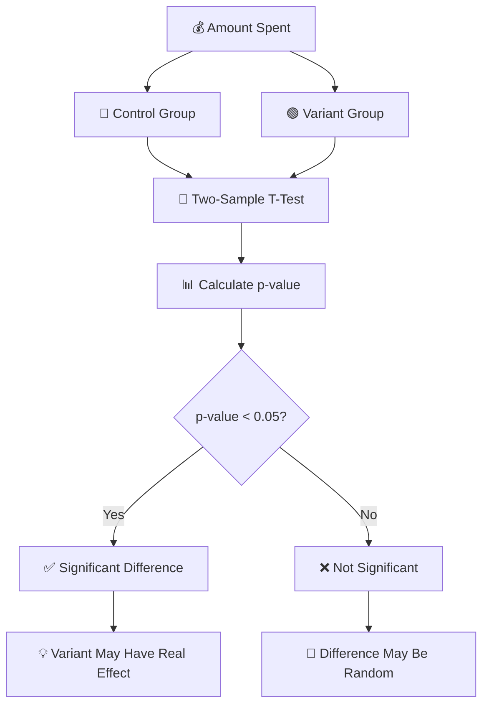

# 🌍 GLOBAL E-COMMERCE & SUPPLY CHAIN PROJECT

> 📊 **Professional Data Analysis Documentation**
> 🛒 E-Commerce • 🚚 Supply Chain • 📈 Statistics • 🧹 Data Cleaning • 💡 Business Insights

---

## 📑 Table of Contents

* [1. Advanced Formulas](#1--advanced-formulas)
* [2. Pivot Tables & Charts](#2--pivot-tables--charts)
* [3. Power Query](#3--power-query)
* [4. Descriptive Statistics](#4--descriptive-statistics)
* [5. Inferential Statistics](#5--inferential-statistics)
* [6. Probability Distributions](#6--probability-distributions)
* [7. Overall Project Workflow](#7--overall-project-workflow)

---

# 1️⃣ Advanced Formulas

## 🔎 A. Find `Membership_Tier` Using XLOOKUP

The objective is to find the customer's **Membership Tier** from the `Customer_Demographics` sheet using the Customer ID from the Sales Data.

### 🧮 Formula

```excel
=XLOOKUP(C2,CUSTOMER_DEMOGRAPHICS!A:A,CUSTOMER_DEMOGRAPHICS!F:F)
```

### 📌 Explanation

| Reference                   | Meaning                     |
| --------------------------- | --------------------------- |
| `C2`                        | Customer ID from Sales Data |
| `CUSTOMER_DEMOGRAPHICS!A:A` | Customer ID column          |
| `CUSTOMER_DEMOGRAPHICS!F:F` | Membership Tier column      |

### 🔄 How It Works


---

## 📧 B. Find Email Domain

The project uses a text formula to extract the domain from an email address.

### 🧮 Formula

```excel
=RIGHT(D2,LEN(D2)-FIND("@",D2))
```

### 📌 Explanation

| Function               | Purpose                         |
| ---------------------- | ------------------------------- |
| `FIND("@",D2)`         | Finds the position of `@`       |
| `LEN(D2)`              | Counts total characters         |
| `LEN(D2)-FIND("@",D2)` | Calculates characters after `@` |
| `RIGHT()`              | Returns the domain              |

### 💡 Example

```text
Email:     customer@gmail.com
Result:    gmail.com
```

### 🔄 Formula Flow


---

# 2️⃣ Pivot Tables & Charts

## 📊 Analysis Objective

Pivot Tables and Charts are used to understand:

* 💰 Revenue earned by each **Product**
* 🏷️ Revenue earned by each **Category**
* 🧭 Comparison between **North and South**
* 📈 Category performance across regions

### 📊 Pivot Analysis



### 🎯 Key Question

> **Which categories dominate in the North compared with the South?**

The Pivot Chart makes this comparison easier to understand visually.

---

# 3️⃣ Power Query

## 🧹 Data Cleaning Objectives

The project contains three major data-cleaning tasks:

1. ✂️ Remove leading/trailing spaces from `Region_Code`
2. 💵 Handle `NULL` values in `Sales_Amount`
3. 📅 Remove dates labeled as `Invalid Date`

The source documentation specifies replacing `NULL` values in `Sales_Amount` with `0` and filtering out `Invalid Date`.

---

## ⚙️ Step 1 — Convert Data into a Table

Use:

```text
Ctrl + T
```

This converts the dataset into an Excel Table.

---

## ✂️ Step 2 — Remove Spaces from `Region_Code`

Go to:

```text
Transform → Format → Trim
```

### 🎯 Purpose

Remove unnecessary:

* Leading spaces
* Trailing spaces

Example:

```text
Before:   "  NORTH  "
After:    "NORTH"
```

---

## 💵 Step 3 — Handle NULL Values

For `Sales_Amount`:

```text
Transform → Replace Value
```

Replace:

```text
NULL → 0
```

This ensures missing sales values are handled consistently.

---

## 📅 Step 4 — Remove Invalid Dates

Use the date filter and uncheck:

```text
Invalid Date
```

### 🔄 Power Query Workflow



---

# 4️⃣ Descriptive Statistics

## 📈 Objective

Calculate the following statistics:

### `Total_Revenue`

* 📍 Mean
* 📍 Median
* 📍 Mode

### `Unit_Price`

* 📐 Variance
* 📏 Standard Deviation

The source specifically asks for Mean, Median and Mode of `Total_Revenue`, plus Variance and Standard Deviation of `Unit_Price`.

---

## 📌 Understanding Variance

| Variance | Meaning                        |
| -------- | ------------------------------ |
| 🟢 Small | Prices are close to each other |
| 🔴 Large | Prices vary a lot              |

### 📊 Statistical Relationship



---

# 5️⃣ Inferential Statistics

## 🧪 Two-Sample T-Test

The project compares **Amount_Spent** between:

* 🔵 Control Group
* 🟢 Variant Group

The source describes separating the Control and Variant values and then performing a t-test.

---

## 📊 Project Results

| Group      | Average Amount Spent |
| ---------- | -------------------: |
| 🔵 Control |             **5.83** |
| 🟢 Variant |             **9.13** |

According to the project documentation, the Variant Group spent more on average than the Control Group.

---

## 🧠 Hypothesis Testing

### Null Hypothesis — H₀

> There is no difference between the two groups.

### Significance Level

```text
α = 0.05
```

### Decision Rule

```text
p-value < 0.05
       ↓
Statistically Significant
```

```text
p-value ≥ 0.05
       ↓
Not Statistically Significant
```

The project documentation states that a significant difference means the difference is unlikely to be due to random chance and interprets this as evidence that the Variant had a real effect on customer spending.

---

## 🧪 T-Test Workflow



---

# 6️⃣ Probability Distributions

## ⏱️ Exponential Distribution

The project assumes customer waiting times follow an **Exponential Distribution**.

### Given

```text
Mean waiting time = 3.5 minutes
```

The required task is to calculate the theoretical probability that a customer waits **longer than 5 minutes**.

---

## 📐 Formula

For an exponential distribution:

$$
P(X>x)=e^{-x/\mu}
$$

Where:

```text
X = Waiting Time
x = 5 minutes
μ = 3.5 minutes
```

Therefore:

$$
P(X>5)=e^{-5/3.5}
$$

### ✅ Result

```text
P(X > 5) ≈ 0.240
```

or approximately:

```text
🎯 24.0%
```

---

## ⏱️ Probability Flow


---

# 7️⃣ Overall Project Workflow


---

# 🎯 Project Summary

| #   | Analysis Area             | Main Objective                        |
| --- | ------------------------- | ------------------------------------- |
| 1️⃣ | 🔎 Advanced Formulas      | Retrieve and transform customer data  |
| 2️⃣ | 📊 Pivot Tables           | Analyze revenue                       |
| 3️⃣ | 📈 Pivot Charts           | Compare regional/category performance |
| 4️⃣ | 🧹 Power Query            | Clean and prepare data                |
| 5️⃣ | 📊 Descriptive Statistics | Summarize the dataset                 |
| 6️⃣ | 🧪 T-Test                 | Compare Control vs Variant            |
| 7️⃣ | 🎲 Probability            | Analyze customer waiting time         |
| 8️⃣ | 💡 Business Insights      | Support data-driven decisions         |

---

## 🏆 Key Business Insights

### 💰 Revenue Analysis

Pivot Tables help identify the products and categories generating revenue and compare performance between regions.

### 🧹 Data Quality

Cleaning `Region_Code`, handling missing `Sales_Amount`, and filtering `Invalid Date` improves dataset quality.

### 🧪 Customer Spending

The documented averages show:

```text
Control  → 5.83
Variant  → 9.13
```

So, the Variant Group spent more on average.

### ⏱️ Customer Waiting Time

With an exponential distribution and a mean waiting time of 3.5 minutes:

```text
Probability of waiting > 5 minutes ≈ 24.0%
```

---

## 🌟 Conclusion

This **Global E-Commerce & Supply Chain Project** demonstrates a complete data-analysis workflow:

```text
📥 Collect Data
      ↓
🔎 Transform Data
      ↓
🧹 Clean Data
      ↓
📊 Analyze Data
      ↓
📈 Visualize Results
      ↓
🧪 Test Hypotheses
      ↓
🎲 Apply Probability
      ↓
💡 Generate Insights
```

> 🚀 **From raw data to meaningful business insights — this project demonstrates the practical use of Excel, data cleaning, statistics, visualization, and analytical thinking in an e-commerce and supply-chain environment.**
